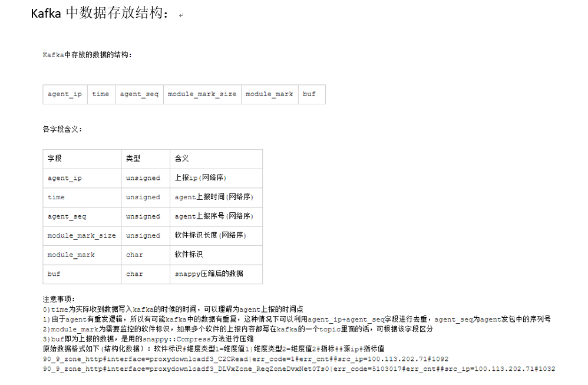

### 背景
&emsp;&emsp;业务侧通过在单机上部署Agent，收集了边缘节点到用户省份粒度的反ping数据，然后通过部门上报的Agent将这份数据上报到了监控系统部门。这里就是他们将一部分数据写到了kafka中，然后部门内的Spark平台提供了消费第三方Kafka消息的功能。因此需要写一个脚本实现将反ping数据落地的功能。 
### Kafka消息格式
   - 具体消息格式如下:
      - 主要是消息数据是字节流（二进制字节流）
      - 前四个字段（每个字段为4个字节）为网络字节序的unsigned int类型
      - 后面两个字段为string类型的字节流，其中第一个字段为软件标识，后一个字段为snappy压缩后的上报数据
      - 
### Spark 配置文件功能
   - streaming_app.cof: 
      - spark的功能配置（默认的资源），同时指定处理脚本名称,消费的topic，第三方kafka 实例
   - streaming_app.cof: 
      - 指定依赖的第三方kafka实例，其中key为topic,value为第三方kafka信息等

### 脚本逻辑解析
   - 中间信息缓存在hdfs上:脚本处理时获取 
      - file_pipe = datask.get_data_pipe(sdlib.PipeType.FILE)
      - rdd_tmp = file_pipe.load_file(file_path_name, False, False).map(lambda line: [str(s) for s in line.split("\t")]).\
        map(lambda x: (x[0], int(x[1]))).collect()
   - 流式数据传输的解包：
      - import struct
      - _bytes_content = bytes(line)
      - agent_ip, agent_time, agengt_seq, module_mark_size = struct.unpack('>4I', _bytes_content[0:16])
      - unpack_format = '%ds%ds' % (module_mark_size,len(_bytes_content)-16-module_mark_size)           # 紧接着的第一个字段是软件标识，最后一个字段是snappy压缩后的文本内容
      - module_mark,content = struct.unpack(unpack_format,_bytes_content[16:])
   - snappy数据解压缩：
      - import snappy
      - content = snappy.uncompress(content)
   - 任务负载均衡，同一链路同一时间对应多个记录，通过调整key统一+reduceByKey 来实现：
      - 原始记录拆分成单条记录：
         - _content = map(lambda x:"%d#%s"%(agent_time,x),filter(lambda y:y,content.split("\n"))) #由于上报数据中是每次上报一批记录数据
      - 将每条记录，归一成统一的key,和value
         - agent_timestamp,_,links,target,src_ip,_,target_value = line.split("#")  #agent上报时间,标识，维度，指标，src_ip,指标值
         - agent_timedate = time.strftime('%Y%m%d',time.localtime(int(agent_timestamp)))
         - key = "time_stamp=%s|time_date=%s|%s"%(agent_timestamp,agent_timedate,links)
         - value = "%s=%s"%(target,target_value)
         - return (key, value)
      - 通过reduceBykey，进行汇聚：
         - result = rdd.filter(lambda line: line is not None and line[1] != '' and line[1] is not None)\
            .map(lambda line: line[1]) \
            .map(lambda line: analysis_line_content(line)) \
            .filter(lambda line: line is not None) \
            .flatMap(lambda line: line.split("\n")) \
            .filter(lambda line: line is not None) \
            .map(lambda line:get_targets_data(line)) \
            .filter(lambda line: line[0] is not None and line[1] is not None) \
            .reduceByKey(lambda x, y: "%s|%s"%(x,y))
    - 数据入库：
       - 获取链路和指标数据：
          - links_d = dict(map(lambda x:x.split("="),line[0].split("|")))
          - values_d = dict(map(lambda x:x.split("="),line[1].split("|"))
       - 指标数据按照日期（对应着表名后缀）汇总：
          - mysql_res[links_d["time_date"]].append(_sql)
       - 批量插入数据：
          - _res_mysql_datas[table_name].append(handler_mysql_datas(table_name, values[0:batch_num]))
       - 重试策略：
          - handler_mysql_datas(table_name,mysql_datas)

